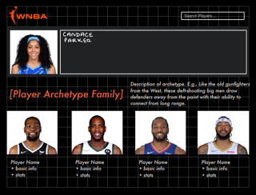
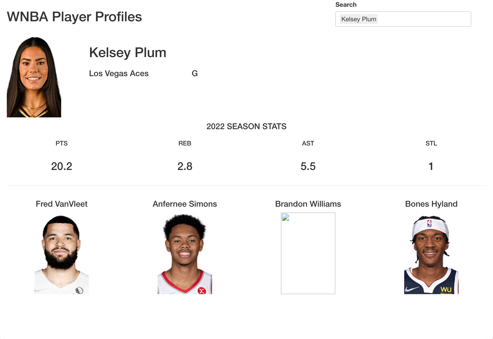
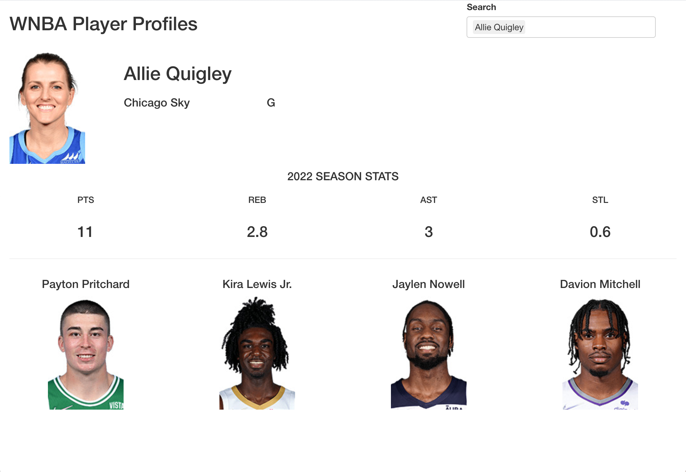
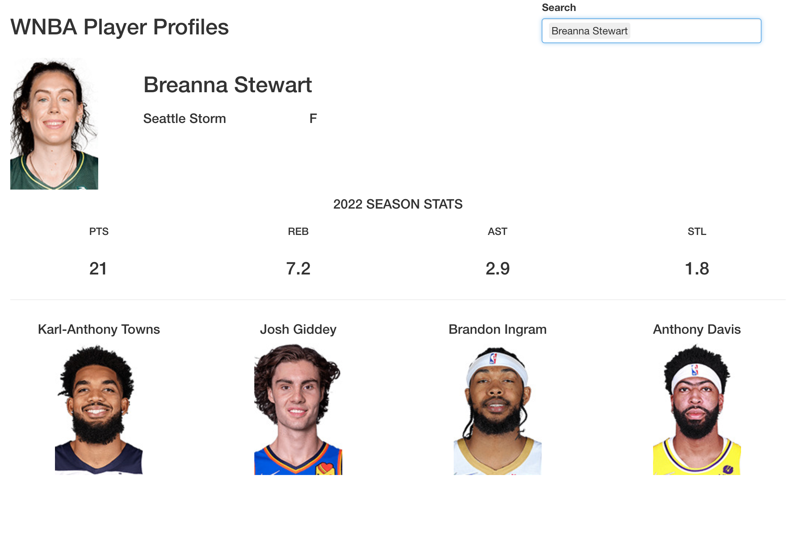

```{css style settings, echo = FALSE}
blockquote {
    padding: 2px 2px;
    margin: 0 0 10px;
    font-size: 14px;
    border-left: 5px solid #eee;
}
```

```{r, echo=FALSE}
htmltools::img(src = knitr::image_uri("report/wnbalogo.png"), 
               alt = 'logo', 
               style = 'position:absolute; top:10; right:0; padding:20px')
```

```{r setup, include=FALSE}
knitr::opts_chunk$set(echo = TRUE)
```

# Introduction:

Over the past decade, with the growing influence of social media and heightened popularity of global stars, interest in women's sports has skyrocketed. However, even with the appearance of high-profile campaigns for equity in sports^1^, it has nonetheless been difficult to cultivate an audience and build a market for women's sports when they receive minimal media coverage compared to their male counterparts^2^. Although major tournaments, such as the WNBA Finals, are strong pulls for fans, the lack of nationally televised games and limited marketing budgets to showcase the players throughout the year has been a barrier for sports fans --- especially established NBA fans --- to consistently engage with the WNBA even when they're interested. Furthermore, although we have seen how statistics can fuel sports passion and storytelling, it was only recently that data and advanced statistics for the WNBA became easily accessible to the public^3^. Therefore, we seek to not only promote sustained fan engagement and interactions with the WNBA, we hope to also provide better and more accessible statistics of the players as well.

**Our project aims to make the following contributions, which will be displayed in a public facing Shiny App:**

> 1.  Develop archetypes of current WNBA players based on each player's tendencies, abilities, and overall statistics
>     -   Conduct archetype exploration on NBA players using the same variables to discover similarities and differences in the type of players between the respective leagues

> 2.  Draw comparisons between WNBA players to NBA players
>     -   Each WNBA player (that has played significant minutes/games) will be matched with 3-5 similar NBA players based SOLELY on their play style

Ultimately, we believe that labeling each WNBA player with an archetype and developing an NBA player comparison can boost year-round engagement and bring the WNBA into the spotlight and keep them there for years to come.

### Shiny app inspiration:



------------------------------------------------------------------------

# Data:

To define player archetypes in the WNBA and compare WNBA players to NBA players, data must be gathered on a seasonal basis. Using Basketball Reference^4^, player statistics were gathered dating back to 2018 (the first year WNBA play-by-play and shot location became available). Relevant variables included:

-   **Per 100 possession statistics** such as:
    -   Points, rebounds, assists
    -   Turnovers, field goals made, field goals attempted
-   **Advanced statistics** designed to demonstrate player tendencies and efficiency such as:
    -   PER, Usage Rate, Win Shares
-   **Play by play statistics** such as:
    -   Type of turnover (bad pass, lost ball)
    -   Foul information (fouls drawn, fouls committed)
-   **Shooting tendency** data such as:
    -   Percentage of shots at the rim, percentage of shots from 3
    -   Percentage of shots that were assisted

This data allows both play style and effectiveness to be evaluated and considered when developing player archetypes and subsequently creating player comparisons between WNBA players and NBA players.

------------------------------------------------------------------------

*Cleaning the WNBA all stats dataset:*

-   Gathered data from the 2018 - 2021 seasons
-   Players with minutes per game \< 10 and games played \< 5 were dropped to remove players who've played an insignificant amount of time
    -   Roughly 25% of players were removed based on an ECDF graph
-   TOT rows were eliminated due to BBallRef miscalculations of TOT rows
    -   If a player played with multiple teams over the course of a season, we kept their statistics from teams on which they played more minutes
-   Re-labeled all player positions to either "G", "F", or "C" for guards, forwards, and centers respectively

*Cleaning the NBA all stats dataset:*

-   Gathered data from the 2018 - 2021 seasons
-   Players with less than 100 total minutes played were dropped to remove players who've played an insignificant amount of time
    -   Roughly 10-15% of players were removed based on minutes played
-   Removed 3 outliers who did not have a TOT column
-   Re-labeled all player positions to either "PG", "SG", "SF", "PF", or "C" for point guards, shooting guards, small forwards, power forwards, and centers respectively

------------------------------------------------------------------------

## EDA

Before modeling or clustering, the distributions of variables within the WNBA dataset were examined to better understand the relationships that are present:

```{r, echo = FALSE, message = FALSE, warning=FALSE}
# Load Libraries and Data -------------------------------------------------

library(rvest)
library(tidyverse)

wnba_all_stats <- read_csv("data/wnba_all_stats.csv")

wnba_pos <- wnba_all_stats %>%
  filter(season >= 2018) %>%
  mutate(pos = case_when(
    pos == "C-F" ~ "C",
    pos == "F-C" ~ "F",
    pos == "F-G" ~ "F",
    pos == "G-F" ~ "G",
    TRUE ~ pos
  ))
```

**Position Distribution:**

```{r position distribution, echo = FALSE, message = FALSE, warning=FALSE}
# Position Distribution

wnba_pos %>%
  filter(season <= 2021) %>%
  group_by(player, pos) %>%
  summarize(n = n()) %>% 
  ggplot(aes(x = pos)) + 
  geom_bar() + 
  theme_bw() + 
  scale_y_continuous(expand = expansion(mult = c(0, 0.05))) +
  theme(plot.title = element_text(hjust = 0.5)) + 
  labs(x = "Position",
       y = "Count",
       caption = "WNBA Players Since 2018",
       title = "Guards and Forwards are much more prevalent than Centers in the WNBA")
```

**Distribution of Minutes Per Game across WNBA Players:**

```{r mpg, echo = FALSE, message = FALSE, warning=FALSE}
# Distribution of Minutes Per Game across WNBA Players

wnba_pos %>% 
  filter(season <= 2021) %>%
  mutate(mpg = mp/g) %>%
  ggplot(aes(x = mpg, color = pos, fill = pos)) + 
  geom_density(alpha = 0.2) + 
  theme_bw() + 
  scale_y_continuous(expand = expansion(mult = c(0, 0.05)))+
  scale_x_continuous(expand = expansion(mult = c(0.01, 0.01)))  + 
  theme(plot.title = element_text(hjust = 0.5),
        legend.position = "bottom") +
  guides(color = "none") + 
  labs(x = "Minutes Per Game",
       y = "Density",
       title = "Guards tend to play more minutes than Forwards and Centers",
       caption = "WNBA player season data since 2018",
       fill = "Position")

```

**Shot distance:**

```{r distance, echo = FALSE, message = FALSE, warning=FALSE}

wnba_pos %>%
  filter(season <= 2021, g >= 5) %>%
  mutate(mpg = mp/g) %>%
  select(1:4, 46:58, 91) %>% 
  filter(mpg > 5) %>%
  select(1:5, mpg, contains("fga")) %>% 
  na.omit() %>%
  ggplot(aes(x = distance, color = pos, fill = pos)) + 
  stat_ecdf() + 
  theme_bw() + 
  scale_y_continuous(expand = expansion(mult = c(0, 0.05)))+
  scale_x_continuous(expand = expansion(mult = c(0.01, 0.01)))  +
  ggthemes::scale_color_colorblind() + 
  ggthemes::scale_fill_colorblind() + 
  theme(plot.title = element_text(hjust = 0.5, size = 11),
        legend.position = "bottom") + 
  labs(x = "Average Shot Distance",
       y = "Proportion of Players",
       title = "A clear chasm exists between the 3 main WNBA positions regarding average shot distance",
       color = "Position")

```

**Field Goals:**

```{r fg, echo = FALSE, message = FALSE, warning=FALSE}
wnba_pos %>%
  mutate(mpg = mp / g,
         pos = fct_recode(pos, 
                    "Center" = "C",
                    "Forward" = "F",
                    "Guard" = "G")) %>%
  # Getting rid of data entry errors and players with not enough minutes
  filter(season <= 2022, g >= 5, mpg >= 5, tm != "TOT") %>%
  ggplot(aes(x = fga)) + 
  geom_histogram(fill = "cornflowerblue", alpha = 0.5, bins = 30) + 
  facet_wrap(~ pos, nrow = 3, scale = 'free_y') + 
  theme_bw() + 
  theme(strip.background = element_blank(),
        plot.title = element_text(hjust = 0.5)) +
  labs(x = "Field Goals Attempted per 100 possessions",
       y = "No. of Players",
       title = "Centers display a wider spread of FG attempts than guards and forwards"
       )
```

**Assist & Block percentage:**

```{r, echo = FALSE, message = FALSE, warning=FALSE}

astpercent <- wnba_pos %>%
  mutate(mpg = mp / g,
         pos = fct_recode(pos, 
                          "Center" = "C",
                          "Forward" = "F",
                          "Guard" = "G")) %>%
  # Getting rid of data entry errors and players with not enough minutes
  filter(season <= 2022, g >= 5, mpg >= 5, tm != "TOT") %>%
  ggplot(aes(x = astpercent)) + 
  geom_histogram(fill = "cornflowerblue", alpha = 0.5, bins = 30) + 
  facet_wrap(~ pos, nrow = 3, scale = 'free_y') + 
  theme_bw() + 
  theme(strip.background = element_blank(),
        plot.title = element_text(hjust = 0.5, size = 11)) +
  labs(x = "Assist Percentage",
       y = "No. of Players",
       title = "Assist rate leans heavily towards guards"
  )
  

blkpercent <- wnba_pos %>%
  mutate(mpg = mp / g,
         pos = fct_recode(pos, 
                          "Center" = "C",
                          "Forward" = "F",
                          "Guard" = "G")) %>%
  # Getting rid of data entry errors and players with not enough minutes
  filter(season <= 2022, g >= 5, mpg >= 5, tm != "TOT") %>%
  ggplot(aes(x = blkpercent)) + 
  geom_histogram(fill = "darkorange", alpha = 0.5, bins = 30) + 
  facet_wrap(~ pos, nrow = 3, scale = 'free_y') + 
  theme_bw() + 
  theme(strip.background = element_blank(),
        plot.title = element_text(hjust = 0.5, size = 11)) +
  labs(x = "Block Percentage",
       y = "No. of Players",
       title = "Block rate leans heavily towards bigs"
  )

library(patchwork)
astpercent + blkpercent

```

------------------------------------------------------------------------

# Methods:

## 1. Developing Archetypes:

To choose which subset of variables were important in determining the archetypes, principal component analysis (PCA) was used to reduce the dimensionality of the feature space.

### PCA:

-   Filtering WNBA all stats columns before PCA:
    -   Only used data from the 2021 season
    -   Filtered out non-numeric, percentages, and highly correlated variables (i.e., fgpercent, fga_2p, corner_3s_attempt)
-   PCA results:
    -   Top 10 dimensions explain 90% of the variability
    -   Grabbed top 3 drivers in each of the top 10 PC's and removed repeated variables
    -   Checked correlation matrix and filtered out highly correlated variables
-   Variables from PCA results to use in clustering:
    -   x3p, distance, trb, orb, ows, ortg, ft, fg, pts, x3par, fga, ftr, pf, tov, drtg, stl, per, blk, ast

### Clustering:

To allow for some uncertainty in the clustering results, a Gaussian Mixture Model (GMM) was used to yield soft assignments for clustering the players.

-   5 clusters were created for both the WNBA and NBA
-   Constructed archetypes by observing and comparing the following statistics from each cluster:
    -   Position distribution
    -   Shooting distance
    -   Average points
    -   Average free throw attempts, field goal attempts, field goal percentage
    -   Average rebounds (total and offensive), assists, steals, blocks, turnovers, personal fouls
    -   Average field goal attempts between 3-10 feet, 10-16 feet, 16 feet - 3's
    -   Average 3-pointers attempts and percentage, true shooting percentage
    -   Average defensive and offensive rating, win share, and player efficiency rating

------------------------------------------------------------------------

## 2. WNBA vs NBA Play Style Comparisons

Before running a model to derive play style comparisons, variables related to play style (and not results) were selected. These included:

-   Field goal attempts per 100 possessions
-   Free throw attempts per 100 possessions
-   Rebounds per 100 possessions
-   Assist percentage
-   Steal percentage
-   Block percentage
-   Average shot distance

To develop a model that outputs an NBA comparison for a WNBA player's play style, a Gaussian Mixture Model (GMM) was trained using the past 5 seasons of NBA data (2018-2022). In doing so, clusters of NBA players were created with corresponding probabilities for each player belonging to each cluster. WNBA player profiles consisting of the same variables were then fed into the model, similarly receiving probabilities of belonging to each cluster. To derive the NBA player most similar to a WNBA player, the Euclidean distance between a WNBA player's cluster probabilities and all NBA player's cluster probabilities was calculated. The NBA player with the lowest corresponding distance of probabilities was selected as the comparison for the WNBA player of interest. A GMM was chosen over K-Means clustering to take advantage of soft assignments and the probabilities generated by a GMM.

These probabilities of an observation being assigned to each cluster were then used to compare players. This was done by computing the Euclidean distance between the cluster probabilities for each observation and taking the 'closest' observation (minimum distance). This allowed a WNBA player to be fed into the model, the distance to be calculated, and to take the 'closest' NBA player and declare that as the player comparison.

------------------------------------------------------------------------

# Results:

## 1. Archetypes: {.tabset .tabset-pills}

### WNBA

*5 clusters/archetypes:*

1.  RESERVES
    -   Benchwarmers
        -   High turnovers & personal fouls
        -   Lowest field goal percentage, offensive rating, and offensive win shares
2.  TRADITIONAL BIGS
    -   Rebounder & rim-protector
        -   High total and offensive rebounds
        -   High close distance shots/layups
        -   High personal fouls
3.  PRIMARY FACILITATOR
    -   Ball handler
        -   High assists & steals
        -   Versatile shooter
4.  PRIMARY SCORERS/INITIATORS
    -   Superstar & shot creator
        -   Offensive skilled combo-forwards
        -   Defensive versatility
        -   Highest usage
5.  SHOOTING THREAT
    -   Sharpshooter
        -   High 3 point attempts and percentage
        -   Low rebounds

### NBA

*5 clusters/archetypes:*

1.  TRADITIONAL BIGS
    -   Rebounder & rim-protector
        -   High total and offensive rebounds
        -   High close distance shots/layups
        -   High personal fouls
2.  PRIMARY FACILITATOR & SHOOTER
    -   Ball handler
        -   High assists, low rebounds
        -   High 3 point attempts and percentage
3.  ROLEPLAYERS
    -   Versatile wings
        -   Reliable shooters
        -   Low usage
4.  PRIMARY SCORERS/INITIATORS
    -   Superstars
        -   Offensive skilled self-creators
        -   Defensive versatility
        -   Highest points, assists, usage, free throw attempts
        -   Highest defensive and offensive win share
5.  RESERVES
    -   Benchwarmers
        -   High turnovers & personal fouls
        -   Lowest offensive rating, offensive win shares and defensive win shares

------------------------------------------------------------------------

## 2. Player Comparison: {.tabset .tabset-pills}

<div style="margin-bottom:40px;">
</div>

**Table of comparisons for 3 example players:**

```{r, echo = FALSE, warning=FALSE, message = FALSE}
library(gt)
library(DT)
comps <- read_csv("data/wnba21_nba22_comps_links.csv")

demo_comps <- comps %>% select(wnba_player, nba_player1, distance, nba_player2, distance2, nba_player3, distance3, nba_player4, distance4) %>% 
  filter(wnba_player %in% c("Allie Quigley",
                            "Kelsey Plum",
                            "Breanna Stewart"))

colnames(demo_comps)[c(1, seq(2, 8, by = 2))] <- c("WNBA Player", 
                                                   "NBA Comp #1", 
                                                   "NBA Comp #2", 
                                                   "NBA Comp #3", 
                                                   "NBA Comp #4")

demo_comps %>%
  mutate(across(.cols = starts_with("distance"), .fns = ~round(., digits = 3))) %>%
  rename(`Distance 1` = "distance",
         `Distance 2` = "distance2",
         `Distance 3` = "distance3",
         `Distance 4` = "distance4") %>%
  gt() %>%
  tab_header(
    title = "Sample of WNBA to NBA Comparisons",
  )

```

<div style="margin-bottom:50px;">
</div>

**Initial shiny app examples for the 3 players in the table above:**

### Plum


### Quigley
 

### Stewart
 


# Discussion:

-   The sample player comparisons listed in the table above do seem to pass the relative eye test. For example, Allie Quigley is known as a sharpshooter, very similar to her top NBA comparison Payton Pritchard
-   The 10 archetypes defined using results-based statistics suggest that NBA and WNBA have nearly identical archetypes
-   MORE TO BE ADDED LATER


### Limitations

-   The process of defining archetypes following clustering was not precise: it relied mostly on a combination of cluster averages and knowledge of basketball
-   Calculating the Euclidean distance of cluster probabilities could lead to some comparisons that are considered erroneous
-   Trying to compare by play style across the WNBA and NBA is a flawed premise because the general style of play is different (e.g lob threats in the NBA)


### Next steps:

-   Produce a metric, regularized adjusted plus-minus (RAPM), to measure attributes and provide better evaluations of WNBA players
    -   Utilize RAPM to create future projections of players
-   Allow for more user interactions within the app 
    -  Add ability for user inputs
-   Try utilizing a decision tree to create comparisons
-   Create a team building player-type evaluation tool 

------------------------------------------------------------------------

# Acknowledgements:

We would like to first express our gratitude toward Carnegie Mellon's Statistics & Data Science Department for providing us a great opportunity to complete a project on sports analytics. In particular, this work would not have been possible without the valuable guidance and support of Dr. Ron Yurko, the lead instructor and director of CMSAC, as well as Maxsim Horowitz, senior data analyst for the Atlanta Hawks, for advising our project. We are also grateful to all of those with whom we have had the pleasure to work during this and other related projects, including our fellow students and teaching assistants.

------------------------------------------------------------------------

# References:

[1] <https://www.teamheroine.com/blog/the-10-best-womens-sport-campaigns-of-2020>

[2] <https://www.si.com/sports-illustrated/2021/03/24/womens-sports-gender-study-discrepancy>

[3] <https://niemanreports.org/articles/covering-womens-sports/>

[4] <https://www.basketball-reference.com/wnba/years/2022_per_game.html>
